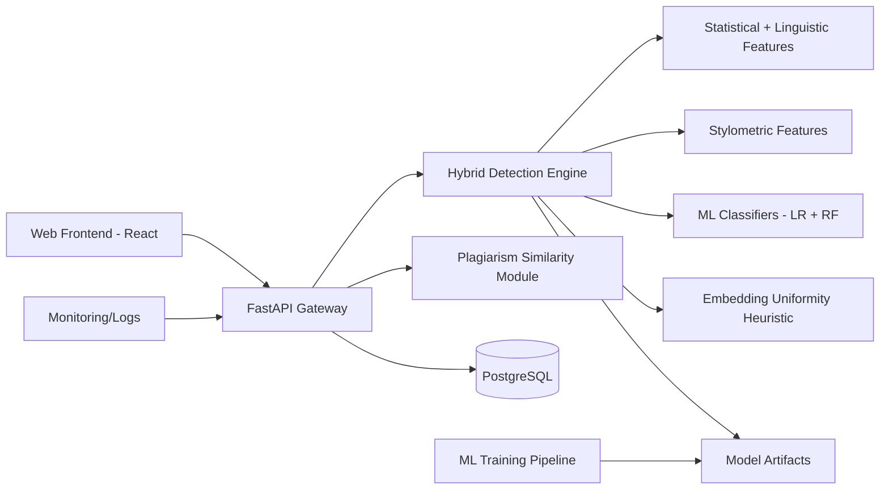

# AuthentiText System Architecture

## Key Decisions
- Hybrid scoring is used to reduce over-reliance on one detector family.
- API outputs probabilities and confidence, not a binary accusation.
- Explainability payload exposes internal features for transparency.
- Sentence-level highlights support human reviewer workflows.
